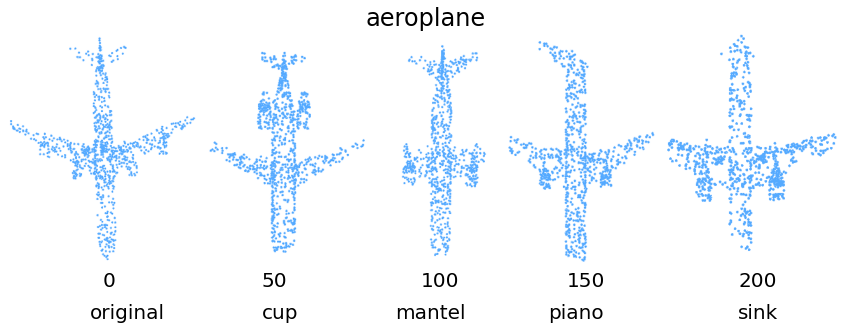
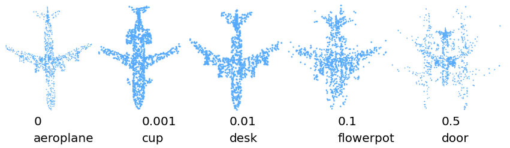

# Adversial-Point-Cloud
### For FGSM attack on point net 
```cd PointNet/``` <br/>
```python3 fgsm_attack.py ``` <br/>
Run the python notebook ```pointnet_fgsm.ipynb```

### For running Saliency Map/FGSM on DGCNN
```cd DGCNN/``` <br/>
```python saurabh_dgcnn.py --exp_name=cls_1024_eval --eval=True --model_path=model.cls.1024.t7 --attack_type='jsma' --alpha=1 --kl=5 --num_drop=300```


Saliency Map attack on pointclouds with increasing number of points removed(0, 50, 100, 150, 200), and classes predicted by trained model

<div style="text-align: center;">
<figure>
  FGSM on with increasing epsilon values (0, 0.001, 0.01, 0.1, 0.5)</figcaption>
</figure>
</div>


